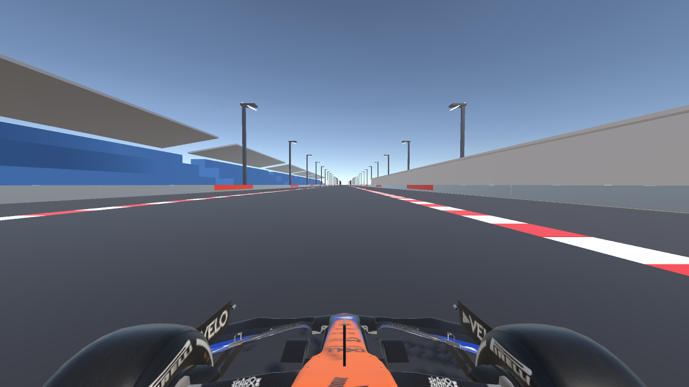
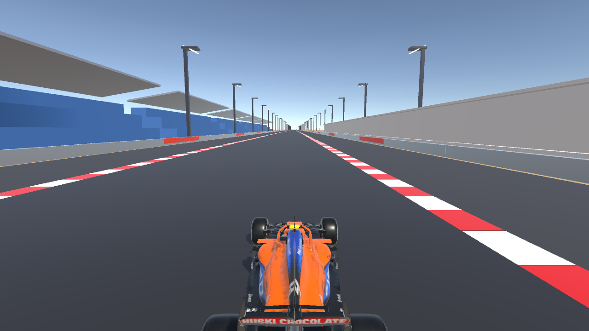

# GridSense — AI-Powered Formula 1 Digital Twin & Real-Time Racing Simulator

<div align="center">


**A high-fidelity Formula 1 engineering simulator combining real-world telemetry ingestion, deep reinforcement learning ERS energy deployment, empirical tyre wear kinetics, multi-compound dynamics, and procedural FIA circuit architecture.**

[Pre-Built Executable](#-standalone-pre-built-executable) • [Circuits](#-four-official-fia-grand-prix-circuits) • [Physics & Vehicle Dynamics](#-vehicle-dynamics--physics-architecture) • [AI & Telemetry](#-ai-digital-twin--machine-learning) • [Hardware Specifications](#-host-machine-specifications) • [Controls](#-controls--keyboard-mapping)

</div>

---

## 📸 In-Simulation Evidence & Showcase

<div align="center">

| Driver Cockpit View | Dynamic Chase Camera |
|:---:|:---:|
|  |  |
| *Real-time halo cockpit view with dynamic steering and F1 HUD* | *High-speed chase perspective featuring damped stabilization* |

| FIA Starting Grid & Gantry | Trackside Architecture Showcase |
|:---:|:---:|
|  |  |
| *Pole position alignment under the official starting lights gantry* | *Circuit infrastructure with pit complex, grandstands, and barriers* |

</div>

---

## 🌟 Executive Summary

**GridSense** is an advanced Formula 1 simulation and digital twin framework built in **Unity 6 (6000.4.1f1)** with the **Universal Render Pipeline (URP)**. It bridges professional motorsport engineering and interactive simulation by marrying:
1. **Real-Time Vehicle Dynamics**: Authentic McLaren MCL35M and Ferrari SF-23 chassis models, active aerodynamic downforce/drag with DRS actuation, four-wheel non-linear grip curves, and power braking with reverse linear thrust.
2. **Energy Recovery System (ERS) Digital Twin**: A 4.0 MJ lithium-ion battery buffer with active MGU-K harvesting under braking, MGU-H thermodynamic recovery, and dynamic deployment profiles benchmarked against a PPO (Proximal Policy Optimization) reinforcement learning agent.
3. **Multi-Compound Tyre Degradation Modeling**: Soft, Medium, and Hard Pirelli compound simulations powered by an Empirical Bayes model trained on real-world FastF1 historical stint data.
4. **Official FIA Grand Prix Circuits**: 4 complete, non-intersecting, procedural 3D circuits with smooth elevation profiles, realistic trackside landmarks, starting grids, and exact plane-crossing lap timing gates.
5. **Multi-Harmonic Hybrid V6 Audio Engine**: Fully procedural engine sound generation with RPM-correlated fundamental frequencies, turbo spooling whine, and exhaust pops.

---

## 🏁 Four Official FIA Grand Prix Circuits

Each circuit features a Catmull-Rom spline centerline, authentic asphalt texturing, continuous 3D road ribbons, runoff shoulders, curvature-aligned FIA kerbs, and authentic trackside architecture.

```
┌──────────────────────────────────────────────────────────────────────────────────────────┐
│                                FIA GRAND PRIX CIRCUITS                                   │
├──────────────────────┬─────────────┬──────────┬──────────────────────────────────────────┤
│ Circuit              │ Length (km) │ Corners  │ Signature Landmarks & Atmospheric Assets │
├──────────────────────┼─────────────┼──────────┼──────────────────────────────────────────┤
│ 1. Bahrain GP        │ 5.412 km    │ 15 Turns │ Sakhir VIP Tower, Oasis Palms, Stadium   │
│    (Sakhir)          │             │          │ Floodlight Towers, Tensile Canopies      │
├──────────────────────┼─────────────┼──────────┼──────────────────────────────────────────┤
│ 2. Spa-Francorchamps │ 7.004 km    │ 19 Turns │ Eau Rouge & Raidillon Hill (+40m Climb), │
│    (Ardennes)        │             │          │ Kemmel Straight, Pouhon, Ardennes Pines  │
├──────────────────────┼─────────────┼──────────┼──────────────────────────────────────────┤
│ 3. Monaco GP         │ 3.337 km    │ 19 Turns │ Sainte-Dévote, Covered Tunnel, Port      │
│    (Monte Carlo)     │             │          │ Hercule Yacht Marina, Swimming Pool      │
├──────────────────────┼─────────────┼──────────┼──────────────────────────────────────────┤
│ 4. Monza GP          │ 5.793 km    │ 11 Turns │ Variante del Rettifilo, Curva Grande,    │
│    (Temple of Speed) │             │          │ Lesmo, Banked Oval Overpass, Parabolica  │
└──────────────────────┴─────────────┴──────────┴──────────────────────────────────────────┘
```

### Circuit Highlights
- **Bahrain International Circuit (Sakhir)**: Features the 8-story Sakhir VIP circular tower, 28m stadium floodlights with night-race ambiance, desert palm groves, and multi-tier main grandstands.
- **Circuit de Spa-Francorchamps**: Features the 40-meter vertical ascent through Eau Rouge and Raidillon,Kemmel Straight hospitality village, multi-tier Ardennes pine forests, and Pouhon double-apex grandstands.
- **Circuit de Monaco**: Faithful urban street circuit with Sainte-Dévote, the Casino square rise, the covered Fairmont tunnel, Port Hercule yacht marina with docked spectator vessels, the Swimming Pool chicane, and Rascasse.
- **Autodromo Nazionale Monza**: The high-speed "Temple of Speed" featuring the Variante del Rettifilo chicane, Curva Grande sweeping arc, Curve di Lesmo, the Serraglio DRS straight passing under the historic 1955 banked concrete oval bridge, Variante Ascari, and the Curva Parabolica (Alboreto).

---

## 🏎️ Vehicle Dynamics & Physics Architecture

### 1. Aerodynamics & Drag Reduction System (DRS)
- **Downforce Coefficient ($C_L$)**: $3.8$ baseline, scaling with $v^2$ to produce over $1,200\text{ kg}$ of vertical load at $300\text{ km/h}$.
- **Drag Coefficient ($C_D$)**: $0.95$ baseline with closed rear wing flap.
- **DRS Actuation**: Activating DRS reduces $C_D$ to $0.63$ ($\Delta C_D = -0.32$), providing a $+15\text{ to }22\text{ km/h}$ top speed advantage down main straights.

### 2. Pirelli Tyre Compound Simulation
Drivers can select between three official tyre compounds with distinctive characteristics:
- **Soft (Red)**: $1.18\times$ maximum lateral and longitudinal grip. Peak performance for qualifying and sprint stints; highest thermal wear rate ($0.038\%\text{ per second at full load}$).
- **Medium (Yellow)**: $1.05\times$ balanced grip with linear wear progression ($0.022\%\text{ per second}$). Optimal for standard Grand Prix stints.
- **Hard (White)**: $0.92\times$ baseline grip, ultra-durable silica compound with minimal degradation ($0.012\%\text{ per second}$). Ideal for extended one-stop strategies.

### 3. Power Brake & Linear Back-Thrust System
In addition to standard hydraulic deceleration ($64.0\text{ m/s}^2$, $\sim 6.5\text{G}$), the vehicle features a dedicated **Power Brake System** (<kbd>Space</kbd>):
- Deceleration increased to $92.0\text{ m/s}^2$ ($\sim 9.4\text{G}$).
- Applies an active reverse linear back-thrust force directly against the vehicle forward vector:
  $$\vec{F}_{\text{thrust}} = -m \cdot 12.0 \cdot \text{sgn}(v_{\text{fwd}}) \cdot \hat{u}_{\text{fwd}}$$
- Enables emergency braking and aggressive corner entry from speeds exceeding $340\text{ km/h}$.

### 4. Multi-Harmonic Hybrid V6 Audio Engine
A fully procedural audio synthesizer implemented in C# on the audio thread:
- Continuous RPM tracking with primary and secondary combustion harmonic synthesis ($f = \frac{\text{RPM} \times 6}{120}$).
- Simulated high-pitch turbocharger spooling frequencies ($1.2\text{ kHz} - 3.8\text{ kHz}$) modulated by throttle percentage.
- Deceleration overrun pops and exhaust crackles when lifting off throttle or downshifting.

---

## 🧠 AI Digital Twin & Machine Learning

GridSense incorporates trained neural network and machine learning models for real-time strategy recommendations:

```
FastF1 Historical Telemetry (CSV) ──► Empirical Bayes Model ──► Tyre Degradation Prediction (.onnx)
Tactical Racing Environment (Gym)  ──► PyTorch PPO Agent     ──► ERS Energy Optimization (.onnx)
                                                                            │
                                                                            ▼
                                                                Unity Sentis Runtime Inference
```

1. **ERS Energy Deployment PPO Agent**:
   - Trained via Proximal Policy Optimization in PyTorch over $250,000$ simulation steps.
   - Observes vehicle velocity, remaining battery state-of-charge (SoC %), circuit progress, and upcoming track curvature.
   - Emits continuous MGU-K motor deployment actions to minimize lap time while preventing battery depletion before the finish line.
2. **Empirical Bayes Tyre Wear Predictor**:
   - Ingests real lap-by-lap stint telemetry from the official FastF1 API.
   - Predicts real-time degradation curve deltas compared against optimal AI targets on the telemetry dashboard.

---

## 🖥️ Live Broadcast Telemetry HUD

The in-game HUD replicates an official Formula 1 broadcast timing and telemetry screen:
- **Lap & Sector Timing Analyzer**: Displays Current Lap, Current Lap Time, S1, S2, and S3 split times with personal best benchmark deltas.
- **Exact Plane-Crossing Gate**: Uses a signed dot-product plane detector ($\vec{d} \cdot \hat{u}_{\text{fwd}}$) at the Start/Finish line to trigger lap completion strictly upon crossing the physical start line.
- **Real-Time Speedometer & Rev Lights**: 15-segment LED rev counter with blue shift warning light and gear readout (R, N, 1-8).
- **Battery & ERS Monitor**: Real-time State of Charge (SoC %) bar, active mode indicator (Deploying, Charging, Balanced, Overdrive), and live Driver vs. Optimal AI deployment graph.
- **Tyre Degradation Monitor**: 4-wheel independent tyre wear indicators (FL, FR, RL, RR) with wear progression curves.
- **Minimap Radar**: Dynamic track map showing the full circuit outline, driver location, and active sector coloration.

---

## 💻 Host Machine Specifications

The project and standalone release build were developed, benchmarked, and verified on the following hardware platform:

```yaml
Hardware Configuration:
  System Model: ASUSTeK COMPUTER INC. Vivobook_ASUSLaptop X1605VA
  Processor (CPU): 13th Gen Intel(R) Core(TM) i5-13420H
    - Architecture: x64-based Processor (Raptor Lake-H)
    - Total Cores: 8 Cores (4 Performance-Cores + 4 Efficient-Cores)
    - Total Threads: 12 Logical Processors
    - Base Clock: 2.10 GHz
    - Max Turbo Frequency: 4.60 GHz
    - L3 Cache: 12 MB Intel® Smart Cache
  System Memory (RAM): 16.0 GB DDR4
    - Physical Memory Installed: 16,794,935,296 bytes (16.0 GB)
    - Available Physical Memory: ~4.8 GB free during compilation
  Graphics (GPU): Intel(R) UHD Graphics
    - Family: Intel® Raptor Lake-H GT1 (Integrated Graphics)
    - Video Memory (VRAM): 2,048 MB Dynamic Allocation
    - Driver Version: 32.0.101.7076
    - Graphics API: Direct3D 11.1 / DirectX 12 Feature Level 11_1
  Operating System:
    - OS Name: Microsoft Windows 11 Home Single Language
    - Version: 10.0.26200 (64-bit Edition)
```

---

## 🎮 Controls & Keyboard Mapping

```
┌───────────────────────────────┬──────────────────────────────────────────────────────────┐
│ Keybinding                    │ Action / Function                                        │
├───────────────────────────────┼──────────────────────────────────────────────────────────┤
│ W / Up Arrow                  │ Throttle (Linear 0 - 100% Acceleration)                 │
│ S / Down Arrow                │ Hydraulic Brake (Standard Deceleration)                  │
│ A / Left Arrow                │ Steer Left                                               │
│ D / Right Arrow               │ Steer Right                                              │
│ Spacebar                      │ Power Brake + Active Reverse Linear Back-Thrust (9.4G)   │
│ D (Toggle)                    │ DRS Flap Open / Close (Active in Straight Zones)          │
│ B (Hold)                      │ MGU-K Boost / Overtake Mode (+120 kW Electric Power)     │
│ C                             │ Cycle Camera (Driver Cockpit ➔ Chase Cam ➔ Orbit Cam)    │
│ R                             │ Reset Vehicle State to Pole Position on Starting Grid    │
│ Tab                           │ Open / Close Pit Wall Engineering Dashboard              │
│ Mouse / Cursor                │ Interactive UI (Circuit Select, Compound Select, Start)  │
└───────────────────────────────┴──────────────────────────────────────────────────────────┘
```

---

## 📦 Standalone Pre-Built Executable

A complete, self-contained standalone Windows build is included directly in this repository under the `Build/` directory:

```
makeSense/
└── Build/
    ├── GridSense_Sim.exe            <-- Standalone Player Executable
    ├── UnityPlayer.dll              <-- Engine Runtime (36.6 MB)
    ├── DirectML.dll                 <-- DirectML Hardware Acceleration
    ├── UnityCrashHandler64.exe      <-- Crash Handler
    ├── MonoBleedingEdge/            <-- Managed .NET Runtime
    └── GridSense_Sim_Data/          <-- Assets, Shaders, Scenes & Resources
```

### Launching the Simulator:
1. Clone or download this repository:
   ```bash
   git clone https://github.com/Aj242005/makeSense.git
   cd makeSense
   ```
2. Navigate to the `Build` directory and launch `GridSense_Sim.exe`:
   ```powershell
   .\Build\GridSense_Sim.exe
   ```
3. On the interactive menu screen:
   - Select your preferred circuit: **Bahrain GP**, **Spa-Francorchamps**, **Monaco GP**, or **Monza GP**.
   - Select your tyre compound: **Soft**, **Medium**, or **Hard**.
   - Press **START SIMULATION / GRAND PRIX SESSION** to enter the cockpit on Pole Position!

---

## 🛠️ Project Structure

```
makeSense/
├── Assets/
│   ├── Audio/                       # Audio clips and sound resources
│   ├── Environments/                # Bahrain, Spa, Monaco, Monza materials & textures
│   ├── Models/                      # F1 Chassis, wheels, steering wheel 3D models
│   ├── Resources/                   # ONNX neural networks (ERS PPO & Tyre EBM)
│   ├── Scenes/                      # MainSimulation.unity master scene
│   ├── Scripts/
│   │   ├── Audio/                   # Procedural hybrid V6 audio engine
│   │   ├── Editor/                  # Master scene builder & automated validation pipeline
│   │   ├── Environment/             # Procedural FIA circuit geometry & visual builder
│   │   ├── Physics/                 # Vehicle dynamics, aerodynamics, power brake, tyres
│   │   ├── Track/                   # Centerline splines, telemetry landmarks & DRS zones
│   │   └── UI/                      # F1 broadcast HUD, timing analyzer & pit wall dashboard
│   ├── Settings/                    # Universal Render Pipeline graphics & quality settings
│   └── Textures/                    # Albedo, normal maps, carbon fiber, FIA kerb textures
├── Build/                           # Pre-compiled standalone Windows release executable
├── EvidenceShots/                   # In-game capture screenshots for documentation
├── Packages/                        # Unity package dependencies (URP, Sentis, Input System)
├── ProjectSettings/                 # Unity engine project settings & physics configurations
├── scripts/                         # Python FastF1 telemetry ingestion & PPO training scripts
├── training_artifacts/              # Datasets, telemetry samples, and training logs
├── GRIDSENSE_SPEC.md                # Comprehensive technical specification document
├── LICENSE                          # MIT License
└── README.md                        # Master project documentation
```

---

## 📜 License

This project is licensed under the **MIT License** — see the [LICENSE](license.txt) file for details.
